# 🏫 Smart Language Monitoring System

> **Course:** NMJ32004 Integrated Design Project · **Group:** 30 · **Semester:** 2, 2024/25

An **IoT-based multilingual speech recognition system** for Malaysian schools that monitors and encourages students to practice speaking in multiple languages. Students interact with an ESP32 device — their speech is recognized, the language is detected, and results are logged to a web dashboard for teachers and administrators.

---

## ✨ Key Features

- 🎙️ **Real-time speech recognition** using OpenAI Whisper
- 🌐 **Automatic language detection** — English, Bahasa Melayu, Mandarin, Tamil
- 📊 **Teacher & Admin web dashboards** with analytics and weekly reports
- 🔊 **Audio feedback** — correct/wrong sounds via ESP32 I2S speaker
- 📱 **ESP32 IoT device** with OLED display and push button
- 🔔 **Notification system** and user management
- 📤 **CSV export** for student interaction logs

---

## 📸 Screenshots

### 🔐 Login & Registration

<p align="center">
  
  &nbsp;&nbsp;
  
</p>

### 👨‍💼 Admin Panel

<p align="center">
  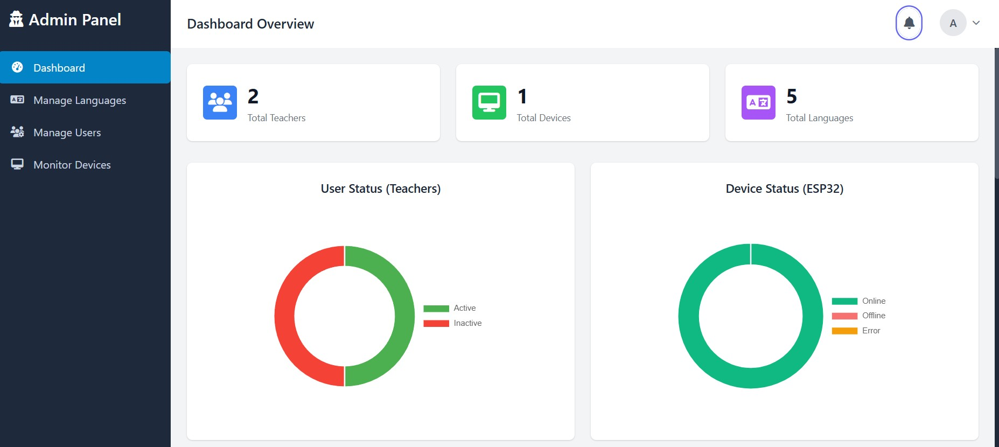
</p>
<p align="center"><em>Admin Overview Dashboard — Charts & Analytics</em></p>

<p align="center">
  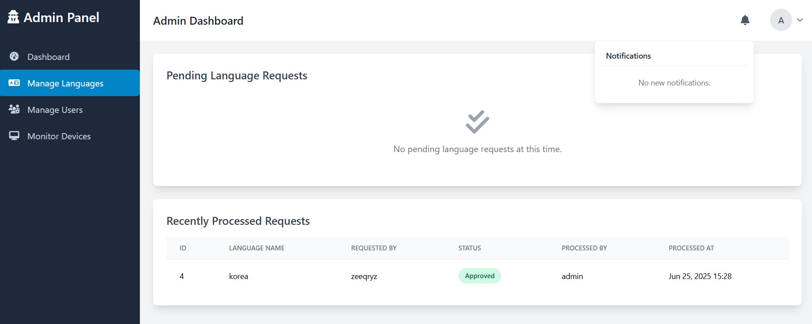
  &nbsp;&nbsp;
  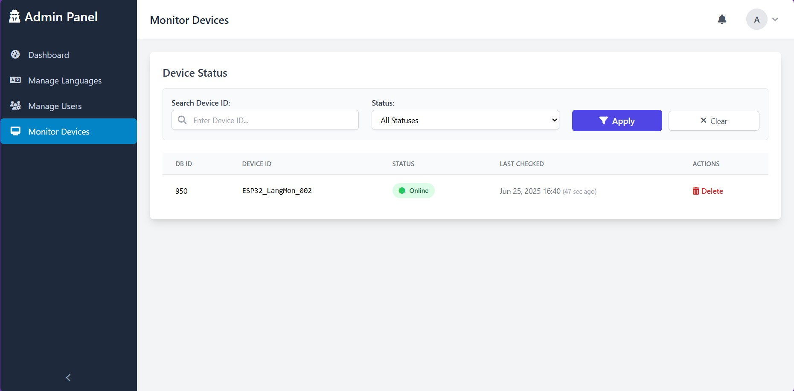
</p>
<p align="center"><em>Manage Languages &nbsp;&nbsp;|&nbsp;&nbsp; Monitor ESP32 Devices</em></p>

<p align="center">
  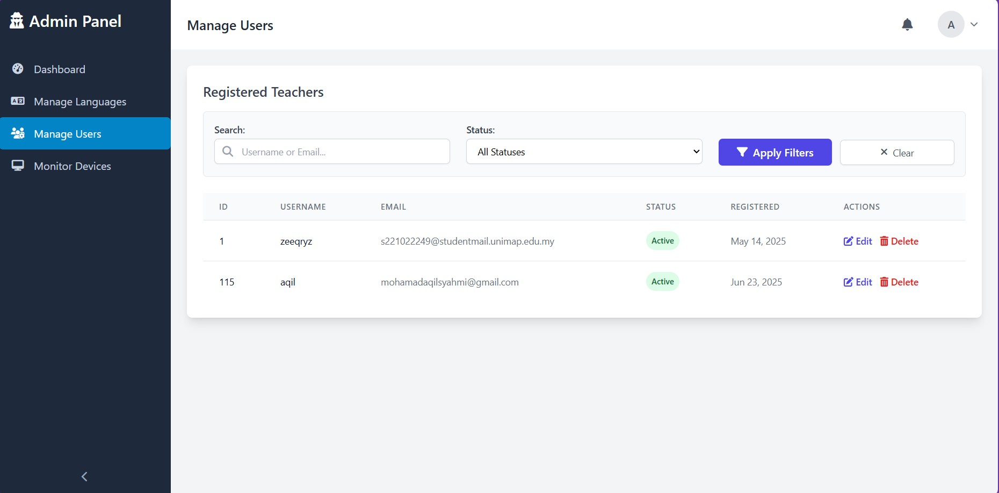
  &nbsp;&nbsp;
  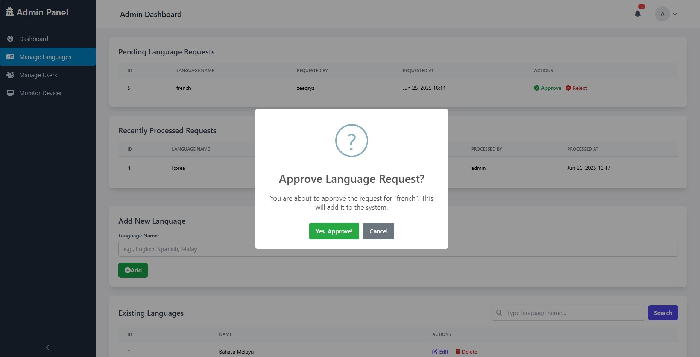
</p>
<p align="center"><em>Manage Users &nbsp;&nbsp;|&nbsp;&nbsp; Approve Language Requests</em></p>

### 👩‍🏫 Teacher Panel

<p align="center">
  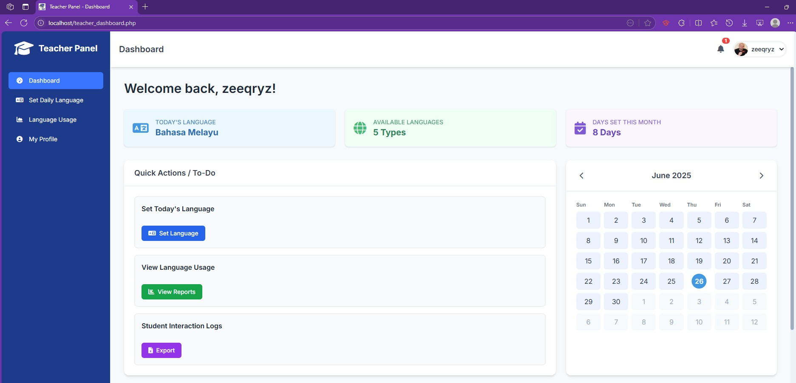
  &nbsp;&nbsp;
  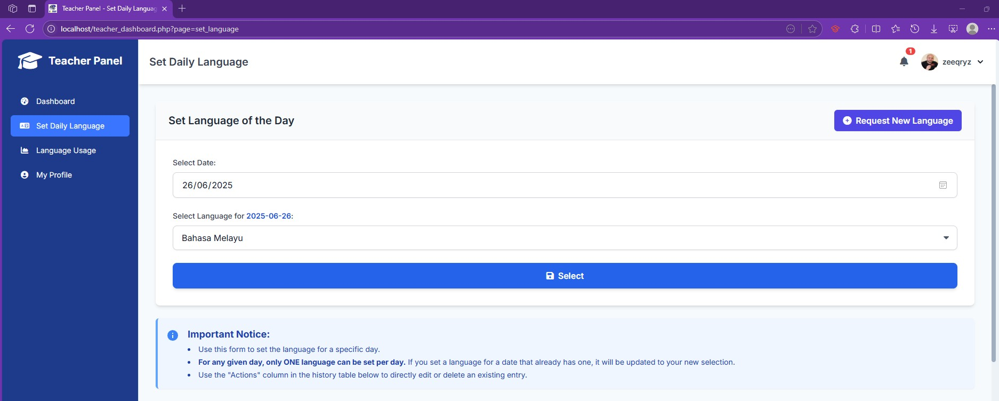
</p>
<p align="center"><em>Teacher Dashboard &nbsp;&nbsp;|&nbsp;&nbsp; Set Target Language</em></p>

<p align="center">
  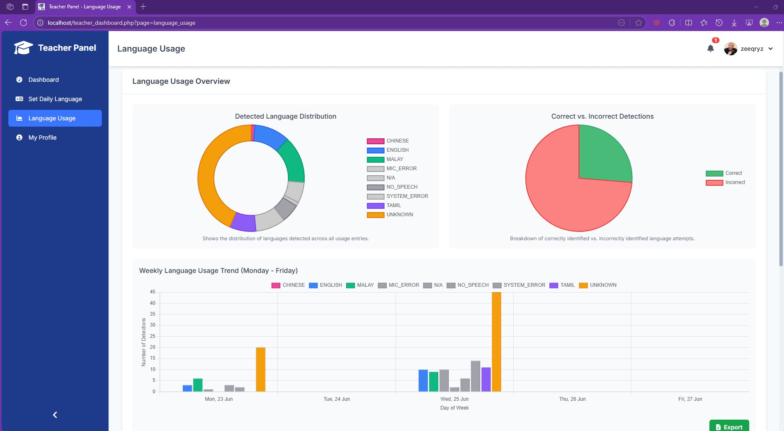
  &nbsp;&nbsp;
  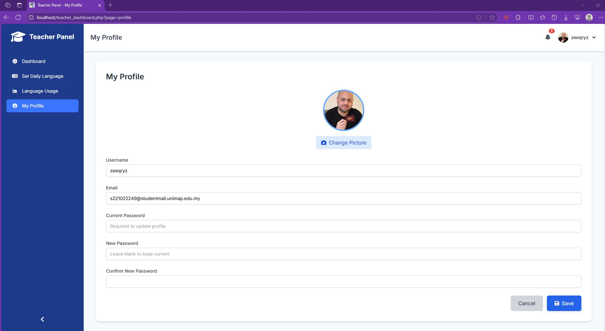
</p>
<p align="center"><em>Language Usage Analytics &nbsp;&nbsp;|&nbsp;&nbsp; Update Profile</em></p>

### 🎓 Student Interaction (ESP32 + Python)

<p align="center">
  
  &nbsp;
  
  &nbsp;
  
</p>
<p align="center"><em>Program Start → Listening for Audio → Correct Answer (English)</em></p>

<p align="center">
  
  &nbsp;
  
  &nbsp;
  
  &nbsp;
  
</p>
<p align="center"><em>Correct: Malay, Chinese, Tamil &nbsp;&nbsp;|&nbsp;&nbsp; Wrong Answer</em></p>

### 🗄️ Database & Web Server

<p align="center">
  
</p>
<p align="center"><em>MySQL Database Table Relations</em></p>

### 🔌 ESP32 Hardware

<p align="center">
  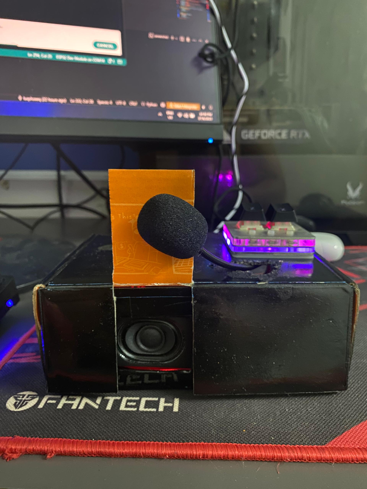
  &nbsp;&nbsp;
  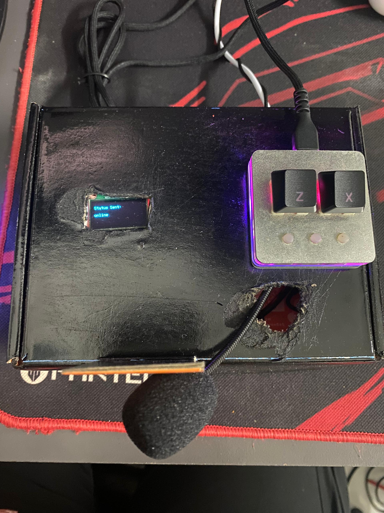
</p>
<p align="center"><em>ESP32 Hardware Setup with OLED Display & Speaker</em></p>

---

## 🛠️ Tech Stack

| Layer | Technology |
|-------|-----------|
| **Frontend** | PHP + CSS (Web Dashboard) |
| **Backend** | PHP (XAMPP Apache) + Python (Speech Engine) |
| **Database** | MySQL |
| **Hardware** | ESP32 + SSD1306 OLED + MAX98357A I2S Speaker |
| **Speech AI** | OpenAI Whisper (transcription) + Lingua (language detection) |
| **Communication** | WiFi HTTP (ESP32 ↔ PHP Server) |

---

## 🧩 System Architecture

```
┌──────────────┐   WiFi HTTP    ┌──────────────────────┐
│   ESP32      │ ──────────────►│  PHP Web Server      │
│   + OLED     │   status/      │  (XAMPP Apache)      │
│   + Speaker  │   trigger      │                      │
│   + Button   │ ◄──────────────│  esp_communication   │
└──────────────┘   result       │  _handler.php        │
                                │         │            │
                                │         ▼            │
                                │  ┌──────────────┐    │
                                │  │ Python       │    │
                                │  │ language_    │    │
                                │  │ monitor.py   │    │
                                │  │ (Whisper +   │    │
                                │  │  Lingua)     │    │
                                │  └──────────────┘    │
                                │         │            │
                                │         ▼            │
                                │  ┌──────────────┐    │
                                │  │   MySQL      │    │
                                │  │   Database   │    │
                                │  └──────────────┘    │
                                └──────────────────────┘
                                          │
                                          ▼
                                ┌──────────────────────┐
                                │  Web Dashboards      │
                                │  - Teacher Dashboard  │
                                │  - Admin Overview     │
                                │  - Device Monitor     │
                                └──────────────────────┘
```

### Data Flow

1. **Student presses button** on ESP32
2. ESP32 sends HTTP request to `esp_communication_handler.php`
3. PHP triggers `language_monitor.py` (Python subprocess)
4. Python records audio → Whisper transcribes → Lingua detects language
5. Result compared to teacher's configured target language
6. Correct/Wrong result sent back to ESP32 → plays audio feedback
7. Interaction logged to MySQL database
8. Teachers/Admins view analytics on web dashboard

---

## 📂 Project Structure

| Folder | Description |
|--------|-------------|
| [`iot_school/`](iot_school/) | Main web application — PHP/MySQL dashboard + Python speech recognition engine |
| [`testcombine/`](testcombine/) | ESP32 Arduino firmware — prototypes and final `combine.ino` sketch |
| [`esp-resources/`](esp-resources/) | ESP32 driver installers, MySQL integration resources, and member-specific firmware |
| [`screenshots/`](screenshots/) | Screenshots & visual documentation of the system |
| [`docs/`](docs/) | Competition poster and final report (PDF) |

---

## 🚀 Quick Start

### Prerequisites

- **XAMPP** (Apache + MySQL)
- **Python 3.8+** with packages:
  ```
  pip install SpeechRecognition gtts playsound lingua-language-detector mysql-connector-python openai-whisper noisereduce numpy
  ```
- **Arduino IDE** with ESP32 board support
- **Composer** (PHP dependency manager)

### 1. Database Setup

1. Start XAMPP → Start Apache & MySQL
2. Open phpMyAdmin (`http://localhost/phpmyadmin`)
3. Create database: `language_monitor`
4. Import `iot_school/main/language_monitor (2).sql`

### 2. Web Server

1. Copy `iot_school/main/` to `C:\xampp\htdocs\main\`
2. Run `composer install` in the `iot_school/` directory
3. Access at `http://localhost/main/`

### 3. ESP32 Firmware

1. Open `testcombine/combine/combine.ino` in Arduino IDE
2. Update WiFi credentials and server URL
3. Flash to ESP32

---

## 👤 User Roles

| Role | Capabilities |
|------|-------------|
| **Teacher** | Set target language, view student logs, export reports, manage profile |
| **Admin** | Manage languages, approve requests, monitor devices, manage users, view analytics |

---

## 🔧 Hardware

| Component | Model | Purpose |
|-----------|-------|---------|
| ESP32 | WiFi-enabled MCU | Main controller + web client |
| SSD1306 OLED | 128×64 pixels, I2C | Display status & results |
| I2S Speaker | MAX98357A DAC | Play correct/wrong audio feedback |
| Push Button | Digital input | Trigger speech recognition |

---

## 📊 Supported Languages

| Language | Flag | Detection |
|----------|------|-----------|
| English | 🇬🇧 | ✅ |
| Bahasa Melayu | 🇲🇾 | ✅ |
| Mandarin | 🇨🇳 | ✅ |
| Tamil | 🇮🇳 | ✅ |

---

## 📄 Documents

- [Competition Poster (PDF)](docs/NMJ32004%20POSTER%20COMP%20Sem2%20202425%20GROUP30.pdf)
- [Final Report (PDF)](docs/NMJ32004%20S2202425%20FR%20COMP%20G30.pdf)

---

## 📝 License

This project is licensed under the [MIT License](LICENSE).

---

## 👥 Team

**Group 30** — NMJ32004 Integrated Design Project, Semester 2, 2024/25  
UniMAP — Universiti Malaysia Perlis
